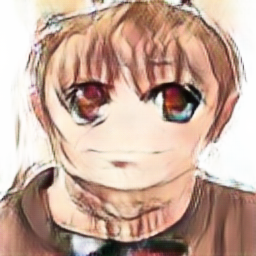

# Deep Convolutional Generative Adversarial Networks using pytorch
## CycleGan from image to Anime face.

## Reference
- Paper: "Unpaired Image-to-Image Translation using Cycle-Consistent Adversarial Networks"
    - [arxiv](https://arxiv.org/pdf/1703.10593)
- Flickr-Faces: [link](https://github.com/NVlabs/ffhq-dataset)
    - I employ a modified variant (reduced in size and reshaped).
- Anime-Face-Dataset: [link](https://github.com/bchao1/Anime-Face-Dataset)
    - In my implementation, the complete dataset is initially retrieved, followed by a subsequent filtering process that selects the largest files. It is worth noting that this filtration procedure is adjustable, allowing for modifications to suit specific requirements..
    
## Requirements
- Python 3
- pytorch ('2.0.0')
- torchvision

## Usage
- python trainer.py --dataset_dir='dataset dir' --result_dir='result dir' \[--options...\]
    - example: python trainer.py --result_dir=./result_sample
    - additional configurations can be located in the 'config.py' file."
- Datasets can be downloaded from links on Google Drive.
	- anime 'https://drive.google.com/uc?id=1Q12fxT5drgPOw9eP0vSooZLd3rkvK7LJ' - zip file
	- faces 'https://drive.google.com/uc?id=19yA3vhY-U5bEMsyt4x2T1QAZfeo5IL4I' - zip file
  
- python get_anime.py 
	- input image have to be in 'input' fold, output image could be found in 'output' fold
    
-The trained model's weights are available for download from Google Drive using the provided link 'https://drive.google.com/uc?id=1-B695LVszuTzwaBja74oBjXS41w9Fcct' - .ckpt file.

## Result
- The last epoch output - real|anime|restored
    - 
- The generation from new face.
    - 
